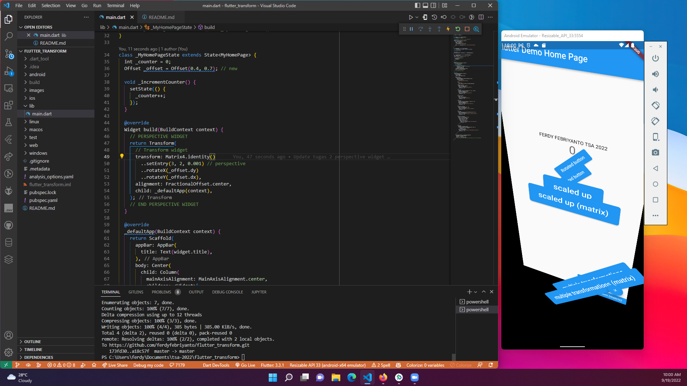

# #33 | FLUTTER TRANSFORM

## PRAKTIKUM

## TUGAS

1. Selesaikan Praktikum tersebut, lalu dokumentasikan dan push ke repository Anda berupa screenshot hasil pekerjaan beserta penjelasannya di file README.md!
2. Tetap di project yang sama, buatlah folder dan file dart baru lalu praktikkan kode yang ada di tautan ini terkait perspektif di flutter!

3. Tetap di project yang sama, buatlah folder dan file dart baru lalu praktikkan kode yang ada di tautan ini untuk membuat flip animasi 3D!
4. Kumpulkan laporan praktikum Anda berupa link repository GitHub ke LMS!

