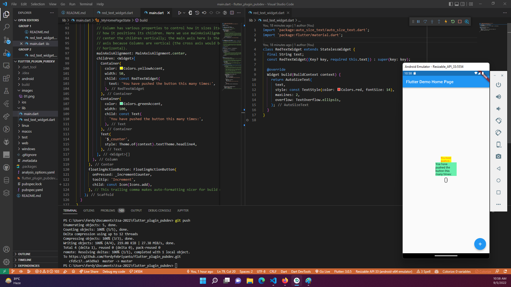

# #22 | Pengenalan Plugin di Pub.Dev

## Tujuan Praktikum

Setelah menyelesaikan codelab ini Anda akan mampu untuk:

* Menjelaskan manfaat plugin
* Memasang plugin ke dalam project flutter
* Memanfaatkan plugin dalam aplikasi

## Daftar Perintah

| Perintah | Fungsi |
| --- | --- | 
| flutter pub add | Untuk menambahkan plugin tertentu ke dalam project | 
| flutter pub get | Mengunduh semua dependensi ke dalam project (biasanya digunakan ketika pertama kali clone project dari repository) | 
| flutter pub outdated | Untuk memeriksa pembaruan semua dependensi yang ada dalam project | 
| flutter pub update | Untuk memperbarui semua dependensi sampai batas versi yang ditentukan dalam pubspec.yaml | 

# Praktikum

## Langkah 1: Buat Project Baru

Buatlah sebuah project flutter baru dengan nama flutter_plugin_pubdev. Lalu jadikan repository di GitHub Anda dengan nama flutter_plugin_pubdev.

## Langkah 2: Menambahkan Plugin

Tambahkan plugin auto_size_text menggunakan perintah berikut di terminal

```bash
flutter pub add auto_size_text
```

Jika berhasil, maka akan tampil nama plugin beserta versinya di file pubspec.yaml pada bagian dependencies.

## Langkah 3: Buat file red_text_widget.dart

Buat file baru bernama red_text_widget.dart di dalam folder lib lalu isi kode seperti berikut.


```dart
import 'package:flutter/material.dart';

class RedTextWidget extends StatelessWidget {
  const RedTextWidget({Key? key}) : super(key: key);

  @override
  Widget build(BuildContext context) {
    return Container();
  }
}
```

## Langkah 4: Tambah Widget AutoSizeText

Masih di file red_text_widget.dart, untuk menggunakan plugin auto_size_text, ubahlah kode return Container() menjadi seperti berikut.

```dart
return AutoSizeText(
      text,
      style: const TextStyle(color: Colors.red, fontSize: 14),
      maxLines: 2,
      overflow: TextOverflow.ellipsis,
);
```

Setelah Anda menambahkan kode di atas, Anda akan mendapatkan info error. Mengapa demikian? Jelaskan dalam laporan praktikum Anda!

* Dikarenakan belum import package auto_size_text
* Belum menambahkan parameter text pada widget RedTextWidget
* Belum menambahkan parameter text pada widget AutoSizeText

## Langkah 5:Buat Variabel text dan parameter di constructor

Tambahkan variabel text dan parameter di constructor seperti berikut.

```dart
final String text;

const RedTextWidget({Key? key, required this.text}) : super(key: key);

```

## Langkah 6: Tambahkan widget di main.dart

Buka file main.dart lalu tambahkan di dalam children: pada class _MyHomePageState

```dart
Container(
   color: Colors.yellowAccent,
   width: 50,
   child: const RedTextWidget(
             text: 'You have pushed the button this many times:',
          ),
),
Container(
    color: Colors.greenAccent,
    width: 100,
    child: const Text(
           'You have pushed the button this many times:',
          ),
),

```

Run aplikasi tersebut dengan tekan F5, maka hasilnya akan seperti berikut.



<br>

# Tugas Praktikum

1. Selesaikan Praktikum tersebut, lalu dokumentasikan dan push ke repository Anda berupa screenshot hasil pekerjaan beserta penjelasannya di file README.md!
2. Jelaskan maksud dari langkah 2 pada praktikum tersebut!

    * flutter pub add auto_size_text: Untuk menambahkan plugin auto_size_text ke dalam project

3. Jelaskan maksud dari langkah 5 pada praktikum tersebut!\

    * final String text: Untuk mendeklarasikan variabel text
    * const RedTextWidget({Key? key, required this.text}): Untuk mendeklarasikan parameter text pada widget RedTextWidget

4. Pada langkah 6 terdapat dua widget yang ditambahkan, jelaskan fungsi dan perbedaannya!

    * Widget pertama (Container) berwarna kuning dengan lebar 50 dan berisi widget RedTextWidget dengan text "You have pushed the button this many times:"
    * Widget kedua (Container) berwarna hijau dengan lebar 100 dan berisi widget Text dengan text "You have pushed the button this many times:"
    * Perbedaannya terletak pada widget yang digunakan, widget pertama menggunakan widget RedTextWidget sedangkan widget kedua menggunakan widget Text
    * Widget RedTextWidget menggunakan plugin auto_size_text sedangkan widget Text menggunakan widget bawaan flutter
    * Widget RedTextWidget memiliki text yang lebih panjang sehingga akan di potong menjadi 2 baris dan ditambahkan tanda titik (ellipsis) di akhir kalimat, sedangkan widget Text tidak memiliki text yang panjang sehingga tidak akan di potong.
    * Widget RedTextWidget memiliki text yang berwarna merah sedangkan widget Text memiliki text yang berwarna hitam.
    * Widget RedTextWidget memiliki text yang lebih kecil dibandingkan widget Text.

5. Jelaskan maksud dari tiap parameter yang ada di dalam plugin auto_size_text berdasarkan tautan pada dokumentasi [ini](https://pub.dev/documentation/auto_size_text/latest/) !

    * text: Text yang akan ditampilkan
    * style: Style dari text
    * maxLines: Jumlah maksimal baris yang ditampilkan
    * overflow: Tipe overflow yang digunakan

6. Kumpulkan laporan praktikum Anda berupa link repository GitHub ke LMS!


